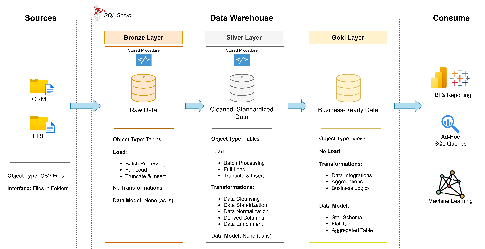

# Data Warehouse and Analytics Project

Welcome to the **Data Warehouse and Analytics Project** repository 🚀
This project demontrates a comprehensive data warehousing and analytics solution, from building a data warehouse to generating actionable insights. Designed as a portofolio projects, highlights industry best practice in data engineering and analytics.

---

## 📋 Project Overview

This project involves:

1. **Data Architecture**: Designing a Modern Data Warehouse Using Medallion Architecture **Bronze**, **Silver**, and **Gold** layers.
2. **ETL Pipelines**: Extracting, transforming, and loading data from source systems into the warehouse.
3. **Data Modeling**: Developing fact and dimension tables optimized for analytical queries.
4. **Analytics & Reporting**: Creating SQL-based reports and dashboards for actionable insights.

> 🎯 This repository is an excellent resource for professionals and students looking to showcase expertise in:
> - SQL Development
> - Data Architect
> - Data Engineering
> - ETL Pipeline Developer
> - Data Modeling
> - Data Analytics

---

## 🚀 Project Requirements

### Building the Data Warehouse (Data Engineering)

#### Objective
Develop a modern data warehouse using SQL Server to consolidate sales data, enabling analytical reporting and informend decision-making.

#### Spesicications
- **Data Sources**: Import data from two soure system (ERP and CRM) provided as CSV Files.
- **Data Quality**: Cleanse and reslove data quality issues prior to analysis.
- **Integration**: Combine both source into a single, user-friendly data model designed for analytical queries.
- **Scope**: Focus on the latest dataset only; historization of data is not required.
- **Documentaion**: Provide clear documentation of the model to support both business stackholder and analytical team.

---

### BI: Analytics & Reporting (Data Analytics)

### Objective
Develope SQL-Based analytics to deliver detailed insights into:
- **Customer behavior**
- **Product Performance**
- **Sales Trends**

These insight empower stackholder with key business metrics, enabling strategic decision-making.

---

## 🏗️ Data Architecture

The data architecture for this project follows Medallion Architecture **Bronze**, **Silver**, and **Gold** layers:



1. **Bronze Layer**: Stores raw data as-is from the source systems. Data is ingested from CSV Files into SQL Server Database.
2. **Silver Layer**: This layer includes data cleansing, standardization, and normalization processes to prepare data for analysis.
3. **Gold Layer**: Houses business-ready data modeled into a star schema required for reporting and analytics.

### Layer Details

| Layer | Object Type | Load Method | Transformations | Data Model |
|-------|-------------|-------------|-----------------|------------|
| **Bronze** | Tables | Batch Processing, Full Load, Truncate & Insert | No Transformations | None (as-is) |
| **Silver** | Tables | Batch Processing, Full Load, Truncate & Insert | Data Cleansing, Data Standardization, Data Normalization, Derived Columns, Data Enrichment | None (as-is) |
| **Gold** | Views | No Load | Data Integrations, Aggregations, Business Logics | Star Schema, Flat Table, Aggregated Table |

### Sources & Consumption

- **Sources**: CRM & ERP (Object Type: CSV Files, Interface: Files in Folders)
- **Consume**: BI & Reporting, Ad-Hoc SQL Queries, Machine Learning

---

## 📁 Repository Structure
```
data-warehouse-project/
|
├── datasets/                    # Raw datasets used for the project (ERP and CRM data)
|
├── docs/                        # Project documentation and architecture details
│   ├── etl.drawio               # Draw.io file shows all different techniques and methods of ETL
│   ├── data_architecture.drawio # Draw.io file shows the project's architecture
│   ├── data_catalog.md          # Catalog of datasets, including field descriptions and metadata
│   ├── data_flow.drawio         # Draw.io file for the data flow diagram
│   ├── data_models.drawio       # Draw.io file for data models (star schema)
│   └── naming_conventions.md    # Consistent naming guidelines for tables, columns, and files
|
├── scripts/                     # SQL scripts for ETL and transformations
│   ├── bronze/                  # Scripts for extracting and loading raw data
│   ├── silver/                  # Scripts for cleaning and transforming data
│   └── gold/                    # Scripts for creating analytical models
|
├── tests/                       # Test scripts and quality files
|
├── README.md                    # Project overview and instructions
├── LICENSE                      # License information for the repository
├── .gitignore                   # Files and directories to be ignored by Git
└── requirements.txt             # Dependencies and requirements for the project
```

---

## 🛡️License

This project is licensed under the [MIT License] (LICENCE). You free to use, modify, and share this project with proper attribution.

## ⭐ About Me

Hi there i'm **Nathan Maulana Achmadi**, i'm a student, aspiring & enthusiast with data engineering and cloud system & architecture
