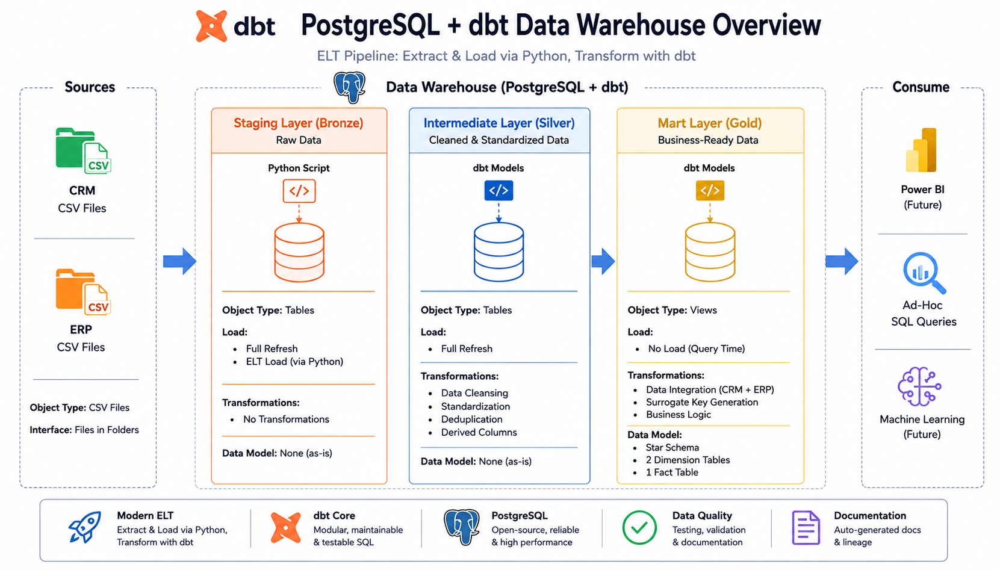

# Data Warehouse - dbt + PostgreSQL

Modern data stack implementation of the Medallion Architecture, using Python for ingestion and dbt for transformation.

## Architecture



## Stack

- Python 3.12, Pandas, SQLAlchemy, python-dotenv
- PostgreSQL 18
- dbt-core 1.9.1, dbt-postgres 1.9.1

## Project Structure

```
warehouse-dbt-postgres/
├── bronze_loader/
│   ├── load_bronze.py       # Python ingestion script (CSV -> bronze schema)
│   └── .env.example         # Credential template (copy to .env, never commit .env)
├── models/
│   ├── silver/               # Cleansed, standardized data (materialized as tables)
│   └── gold/                 # Star Schema: dimensions & facts (materialized as views)
├── tests/                     # Singular (custom SQL) data tests
├── requirements.txt
└── dbt_project.yml
```

## Setup

1. Create a PostgreSQL database (default expected name: `data_warehouse`).
2. Create a virtual environment and install dependencies:
   ```
   python -m venv dbt-env
   dbt-env\Scripts\activate      # Windows
   pip install -r requirements.txt
   ```
3. Set up ingestion credentials:
   ```
   cd bronze_loader
   copy .env.example .env
   # edit .env with your actual PostgreSQL credentials
   ```
4. Set up your dbt profile (`~/.dbt/profiles.yml`) to point to the same database, or run `dbt init` and follow the prompts.

## Running the Pipeline

```
# 1. Load raw CSV data into the bronze schema
cd bronze_loader
python load_bronze.py

# 2. Run dbt transformations (silver + gold layers)
cd ..
dbt run

# 3. Run data quality tests
dbt test

# 4. Generate and view documentation
dbt docs generate
dbt docs serve
```

## Data Model

**Silver layer** (schema: `public`, materialized as tables): cleansed versions of each raw source table, with standardized values, deduplication, and type corrections.

**Gold layer** (schema: `public`, materialized as views), Star Schema:
- `gold_dim_customers` - customer dimension (merges CRM + ERP customer data)
- `gold_dim_products` - product dimension (current products only)
- `gold_fact_sales` - sales fact table, linked to both dimensions via surrogate keys

## Data Quality Findings

Running `dbt test` surfaces two notable findings from the source data (not code defects):

1. **One row with a `NULL` `cst_id`** in the raw CRM customer data - filtered out at the Silver layer, since a customer record without an ID can't be reliably deduplicated or joined.
2. **15 customer birthdates between 1916-1923** - flagged by a test as unusually old (threshold: 1924), but not impossible. This is treated as a `warn`-severity test rather than a hard failure, since it's a business judgment call rather than a technical error.

## Known Technical Notes

- ERP source columns (`CID`, `BDATE`, `GEN`, etc.) are uppercase in the raw CSVs, while CRM columns are lowercase. This is handled explicitly in each Silver model via quoted identifiers, then aliased to lowercase for consistency.
- Some date columns arrive as raw 8-digit integers (e.g. `20250714`) rather than native date types; these are parsed using `to_date(x::text, 'YYYYMMDD')`.